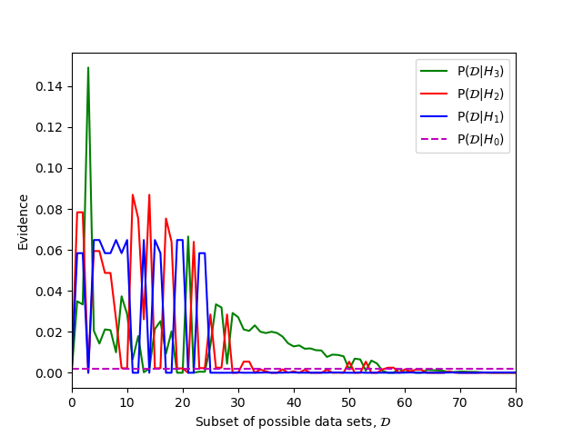

# Evidence and Bayesian Occam's Razor

Reproducing the example of the implicit Occam's razor effect of Bayesian model
comparison that is used in Murray I., Ghahramani Z. (2005) A note on the
evidence and Bayesian Occam’s razor, GCNU-TR 2005-003.

The report is included in the repo as `GCNU-TR_2005-003.pdf` for reference or
can be found online at
[www.gatsby.ucl.ac.uk](http://www.gatsby.ucl.ac.uk/publications/tr/tr05-003.pdf).

## Description

Please find the python code in `code.py`

These graphs and data sets show that by comparing the evidence of Bayesian models
the simplest model is preffered as in Occam's razor. We create an example
dataset of all the possibly labellings of a 3x3 grid, either o or x.

We then formulate four simple models: H₀ assigns constant probability,
H₁ is linear regression with a parameter for one dimension, H₂ a
linear regression with parameters for both dimensions and H₃ the same as
H₂ with the addition of an bias parameter. You should see that as a model
increases in complexity it places more probability among a greater number of
datasets and is therefore less sure while the simpler models despite describing
fewer models assign more of their weight to the data they can describe well.

The datasets for which the evidence is maximal are also displayed below and these
are coherent with our models.  H₀ has equal evidence for all the datasets
so is ignored, but H₁ and H₂ are clearly linearly boundaries in one
and two dimensions while the bias parameter of H₃ allows it to push the
boundary off of the dataset.

The datasets for the graphs are ordered as in the Appendix of the paper.

## Results




Dataset that maximises P(D|H₁)
```
x x x 
o o o 
o o o 
```

Dataset that maximises P(D|H₂)
```
x o o 
x o o 
x x o 
```

Dataset that maximises P(D|H₃)
```
x x x 
x x x 
x x x 
```

### Prerequisites

This code relies upon the python packages
* numpy
* matplotlib
* itertools
* scipy

### Running

Can run to produce either the graphs above as output or the grid of inputs as
TikZ code for formatting in LaTeX

For `matplotlib.pyplot` graphs:

```
./code.py graph
```

For the maximal evidence datasets:

```
./code.py draw
```
