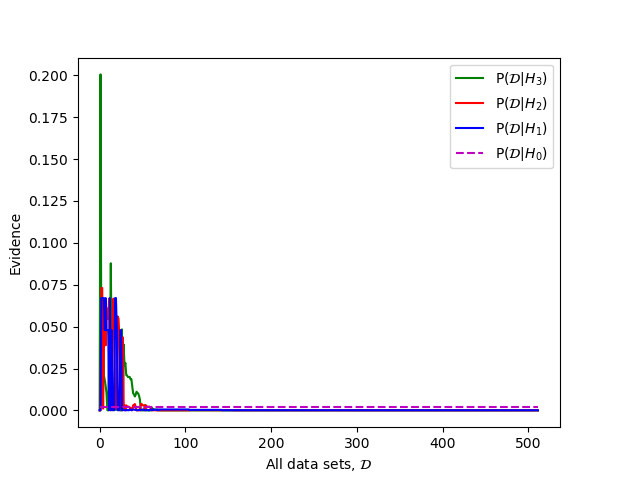

# Evidence and Bayesian Occam's Razor

Reproducing the example of the implicit Occam's razor effect of Bayesian model
comparison that is used in Murray I., Ghahramani Z. (2005) A note on the
evidence and Bayesian Occam’s razor, GCNU-TR 2005-003.

The report is included in the repo as `GCNU-TR_2005-003.pdf` for reference or
can be found online at
[www.gatsby.ucl.ac.uk](http://www.gatsby.ucl.ac.uk/publications/tr/tr05-003.pdf).

## Description

What it shows

## Results




Dataset that maximises P(D|M₀)
```
o o o 
o o o 
o o o 
```

Dataset that maximises P(D|M₁)
```
x x x 
o o o 
o o o 
```

Dataset that maximises P(D|M₂)
```
x o o 
x o o 
x x o 
```

Dataset that maximises P(D|M₃)
```
x x x 
x x x 
x x x 
```

### Prerequisites

This code relies upon the python packages
* numpy
* matplotlib
* itertools
* scipy

### Running

Can run to produce either the graphs above as output or the grid of inputs as
TikZ code for formatting in LaTeX

For `matplotlib.pyplot` graphs:

```
./main.py graph
```

For the maximal evidence datasets:

```
./main.py draw
```
